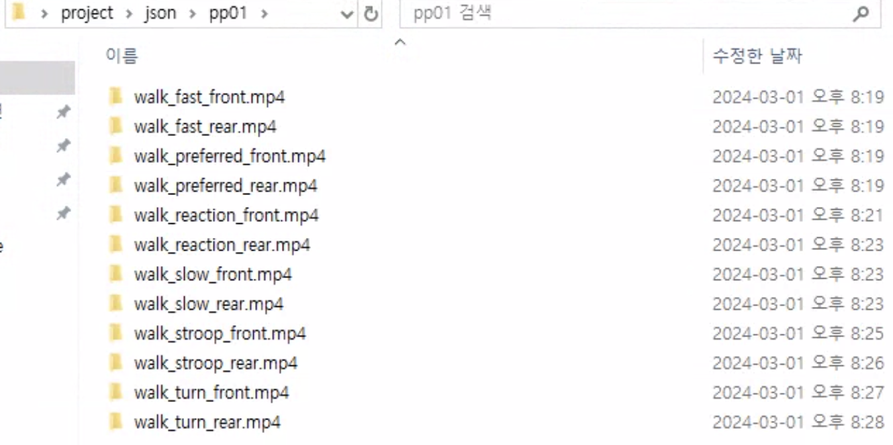
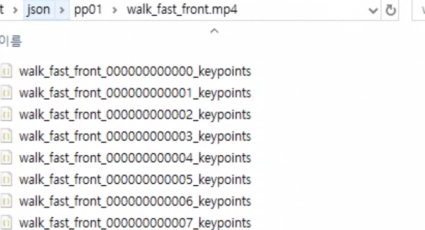
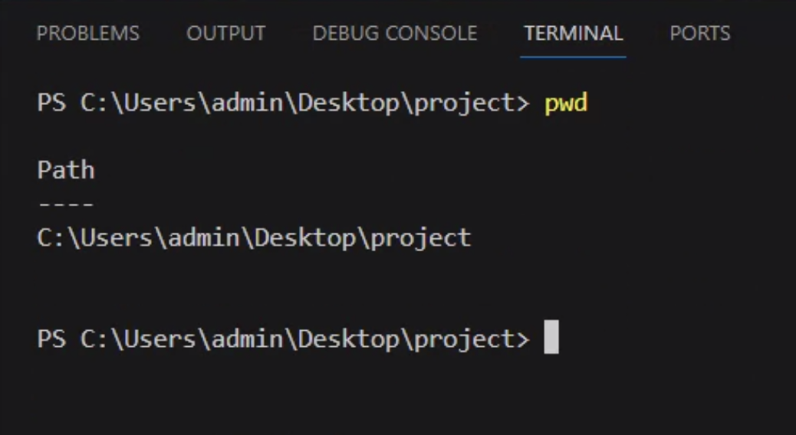

# data_processing.md

코드를 열어보면, 아래와 같은 3개의 변수를 확인할 수 있습니다.

## 조작해야 할 변수
- json_dir_path
- openpose_path
- video_dir_path

자신의 환경에 맞게, 위의 변수들에 경로를 입력하면 됩니다.  
아래는 예시 코드입니다.

```python
json_dir_path = 'C:/Users/admin/Desktop/project/json_test/'
openpose_path = 'C:/Users/admin/Desktop/project/openpose-1.7.0/openpose/bin/OpenPoseDemo.exe'
video_dir_path = 'C:/Users/admin/Desktop/project/openpose-1.7.0/openpose/video/'
```

### json_dir_path
OpenPose를 이용해서 나온 프레임별 json 파일을 저장할 경로입니다.
처리할 비디오가 여러개인 경우에는, 자동으로 해당 경로에 비디오 이름과 동일한 폴더를 만들고 json file을 저장합니다.<br>
아래는 예시입니다.



### openpose_path
OpenPoseDemo.exe의 경로를 넣어줘야 합니다.

### video_dir_path
여러개의 비디오가 저장된 폴도의 경로를 넣어줘야 합니다.

## 중요사항
***이게 가장 중요합니다.***<br>
visual studio 기준으로 설명하겠습니다.<br>
코드를 실행을 시킬 때, 터미널의 현재 경로를 openpose로 이동해야 합니다.<br>

### 올바른 예시


### 잘못된 예시


이건 뇌피셜인데, OpenPoseDemo.exe를 실행하면, 내부적으로 상대경로를 이용해서 모델의 정의와 가중치를 가져오는 것 같아요. 이거 때문에 고생을 많이 했답니다.ㅎ..ㅎㅎ

